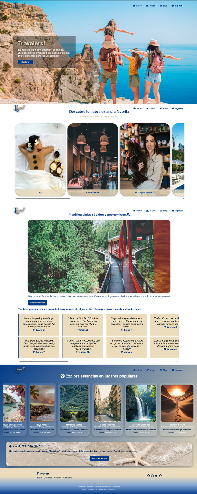
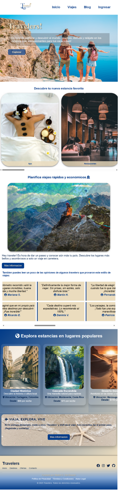
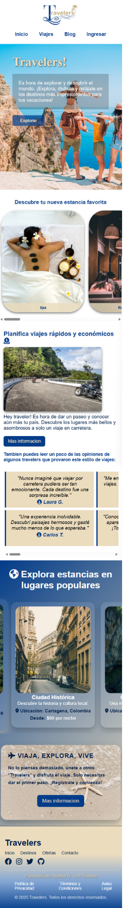
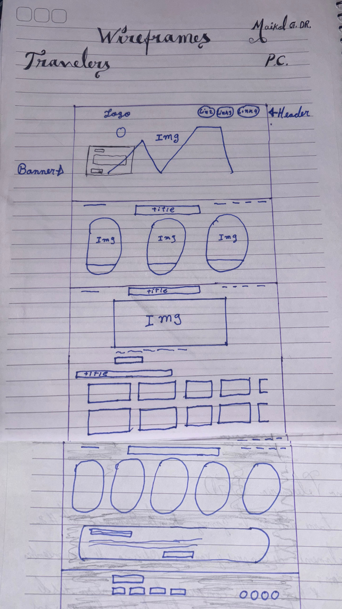
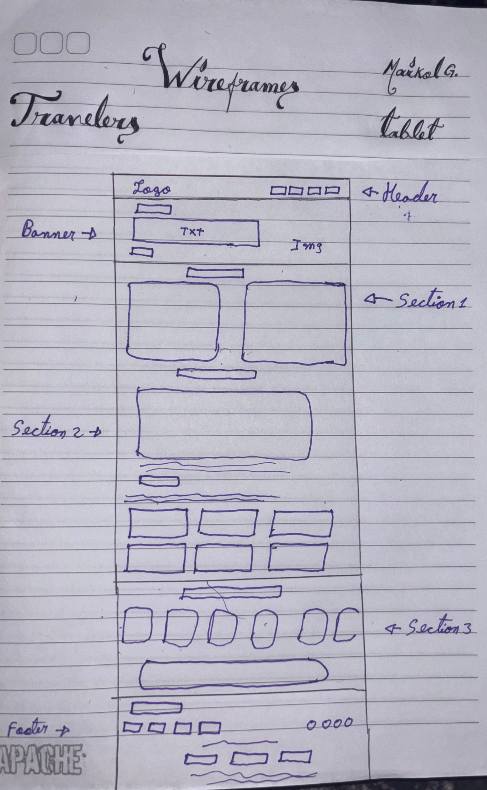
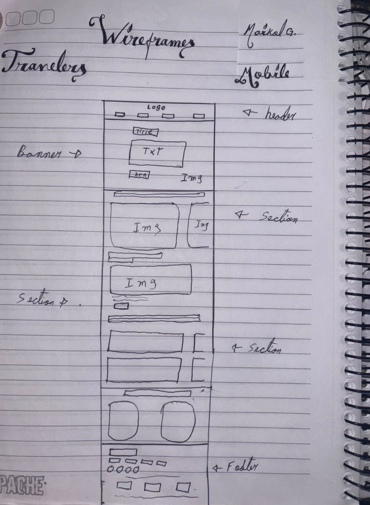

# Travlers

## 🌍 Descripción  
Hey! ¡Hola hola! Te cuento un poco sobre mi proyecto **Travlers**. Es una plataforma web diseñada para brindar información sobre destinos turísticos. La diseñé para que todos los usuarios que ingresen cuenten con la información que necesiten, ofreciendo recomendaciones y contenido visual atractivo para los viajeros. ✈️🌎  
El objetivo es inspirar y ayudar a los usuarios a planificar sus próximos viajes de manera sencilla y accesible.

## ✨ Características  
- 📌 Información sobre diversos destinos turísticos.  
- 🎨 Diseño atractivo y adaptable a distintos dispositivos.  
- 🧭 Navegación intuitiva para una mejor experiencia de usuario.  

## 🚀 Tecnologías Utilizadas  
- **HTML** - Para la estructura del sitio.  
- **CSS** - Para el diseño y estilos visuales.  
- 🔧 *El sitio web aún está en desarrollo, por lo que actualmente solo utiliza estas dos tecnologías.*  

## 📜 Licencia  
Este proyecto está protegido bajo la licencia **All Rights Reserved**.  
Todos los derechos están reservados y no se permite la reproducción, distribución o modificación sin autorización expresa del autor. 🚫🔒  

## 📷 Imágenes del proyecto  

### 🖥️ Modo PC  
  
 

### 📱 Modo Tablet   
  

### 📱 Modo Mobile    
  

# 🎨 Wireframes del proyecto  

### 🖥️ Modo PC  
  

### 📱 Modo Tablet   
  

### 📱 Modo Mobile   
  
